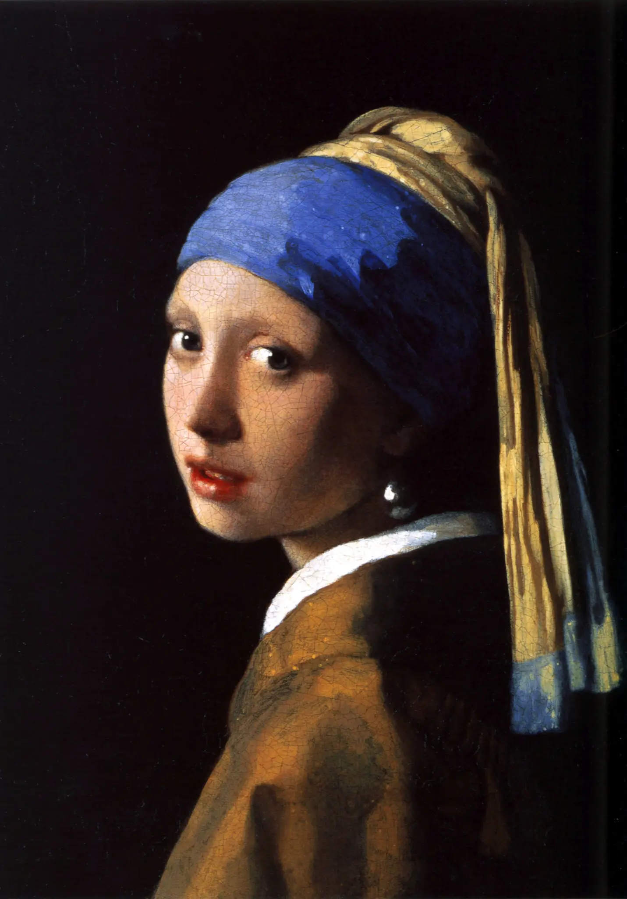
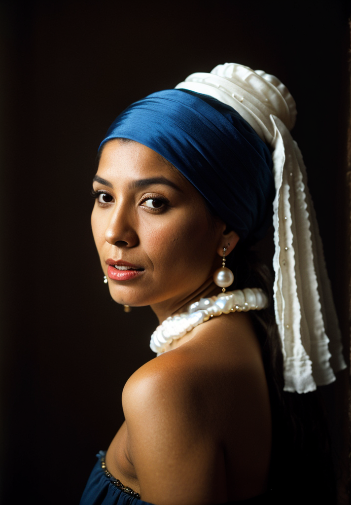

# realistic-vision-v5-img2img Cog model

This is an implementation of img2img using the model [/SG161222/Realistic_Vision_V5.0_noVAE](https://huggingface.co/SG161222/Realistic_Vision_V5.0_noVAE) as a Cog model. [Cog packages machine learning models as standard containers.](https://github.com/replicate/cog)

First, download the pre-trained weights:

    cog run script/download-weights

Then, you can run predictions:

    cog predict -i image=@demo.jpg -i prompt="a latina woman with a pearl earring" -i negative_prompt="(deformed iris, deformed pupils, semi-realistic, cgi, 3d, render, sketch, cartoon, drawing, anime, mutated hands and fingers:1.4), (deformed, distorted, disfigured:1.3), poorly drawn, bad anatomy, wrong anatomy, extra limb, missing limb, floating limbs, disconnected limbs, mutation, mutated, ugly, disgusting, amputation"

## Example:

Input - "a latina woman with a pearl earring"

Output:

